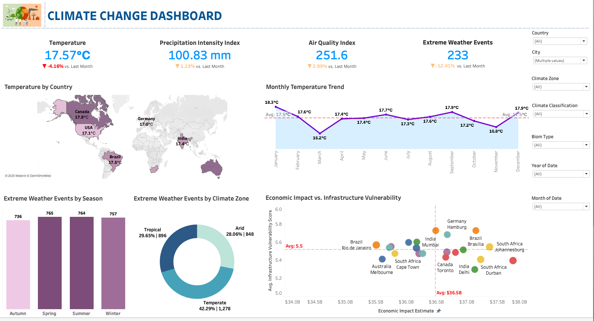

# 🌍 Climate Change Dashboard



This project provides a comprehensive analysis of global climate change indicators using data visualization and structured querying. It highlights patterns in temperature, precipitation, air quality, and extreme weather events, offering insight into how climate change affects different regions and infrastructures.

---

## 📊 Overview

The **Climate Change Dashboard** presents key metrics and visual trends to analyze climate change across countries, seasons, and climate zones. The dashboard visualizes:

- Global and regional temperature patterns  
- Frequency and distribution of extreme weather events  
- Air quality trends  
- Economic vulnerability due to climate impact  

---

## 🧰 Tech Stack

- **Tableau**: For interactive dashboard creation and data visualization.  
- **MySQL Workbench**: For writing SQL queries, managing data relationships, and transforming datasets for analysis.  
- **Mapbox (via Tableau)**: For geospatial representation of country-level climate data.  

---

## 🌐 Explore the Interactive Dashboard
The fully interactive version of this dashboard is available on **Tableau Public**:  
👉 [View Dashboard on Tableau Public]([https://www.kaggle.com/your-dashboard-link](https://public.tableau.com/app/profile/jil.patel4324/viz/ClimateChange1_17566099916020/Dashboard1))

---

## 📁 Features & Visualizations

### 1. **Key Climate Indicators**
- **Temperature**: Average global temperature with monthly change percentage.  
- **Precipitation Intensity**: Total rainfall in millimeters.  
- **Air Quality Index (AQI)**: Represents current pollution levels.  
- **Extreme Weather Events**: Total events and comparison with the previous month.  

### 2. **Temperature by Country**
- Interactive map showing average temperatures for countries such as Canada, USA, Brazil, India, Germany, and Australia.  

### 3. **Monthly Temperature Trend**
- Line chart displaying monthly average temperatures and comparing them with the yearly average.  

### 4. **Extreme Weather Analysis**
- **By Season**: Bar chart of seasonal event distribution (Spring, Summer, Autumn, Winter).  
- **By Climate Zone**: Donut chart classifying events into Tropical, Arid, and Temperate zones.  

### 5. **Economic Impact vs. Infrastructure Vulnerability**
- Scatter plot illustrating the relationship between climate-related economic loss and infrastructure resilience across major cities.  

---

## 🛠️ Data Process & Workflow

### 1. **Data Preparation (MySQL Workbench)**
- Imported multiple climate datasets into MySQL.  
- Created SQL queries to:
  - Aggregate monthly temperature and precipitation data.  
  - Join and filter data by region, climate zone, and event type.  
  - Classify events by season and climate zone.  
  - Calculate infrastructure vulnerability scores and economic estimates.  

### 2. **Data Visualization (Tableau)**
- Imported cleaned and structured datasets from MySQL.  
- Designed and built an interactive dashboard using Tableau.  
- Used calculated fields, filters, and dynamic elements to enhance user interaction and insight generation.  

---

## 🎯 Objectives

- Understand global and regional climate trends.  
- Visualize the frequency and impact of extreme weather events.  
- Analyze economic vulnerability tied to climate change.  
- Provide a tool that supports climate-related policy and planning decisions.  

---

## 📌 Key Insights

- Global average temperature this month: **17.57°C** (↓ 4.16% from last month).  
- **Tropical** and **Temperate** zones account for over 70% of extreme weather events.  
- **Spring** and **Summer** have the highest event frequencies.  
- Cities like **Rio de Janeiro** and **Johannesburg** show high vulnerability to economic loss due to climate events.  

---

## 📂 Repository Structure

```
Climate-Change-Dashboard/
│
├── README.md
├── data/                 # sample or full datasets (if small enough & public)
│   └── climate_sample.xlsx
├── tableau/              # Tableau project files
│   ├── Climate_Change_Dashboard.twbx   # packaged workbook (with data extracts)
│   └── Climate_Change_Dashboard.twb    # workbook only (structure & visuals)
├── assets/               # Images for README
│   └── climate_dashboard.png
```

---

## 🔍 Future Improvements

- Integrate live data feeds for real-time updates.  
- Build predictive models (e.g., ARIMA or regression) for temperature and AQI forecasting.  
- Include satellite imagery for enhanced visual context.  
- Publish dashboard on Tableau Public in addition to Kaggle.  

---

## Author

This project was developed to explore climate change data through structured analysis and dynamic visualization. SQL was used for data modeling, and Tableau for interactive storytelling.  
